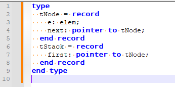

# Algorithm User Defined Language XML document
Adding this definition to Notepad++ highlights key words of used algorithm language for subjects like Prácticas de programación and Fundamentos de Programación.

# How to apply the style in your Notepad++

Once nppp is installed 

1. In Notepad++ select the menu Language
2. Select `User Defined Language` option
3. Select `Define your language....` option
4. Click on `Import...` button and select the downloaded xml file.

Example:

